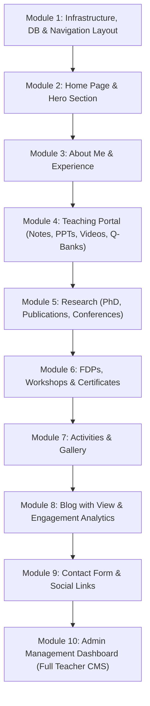

# Implementation Plan: Modular Breakdown for Prof. Ashwini Sawant Portfolio & CMS

To ensure smooth, incremental development, the project is divided into **10 granular micro-modules**. We will build and test each module step-by-step.

---

## 🚀 Micro-Module Development Roadmap

---

### **Module 1: Infrastructure, DB & Navigation Layout (Current Starting Point)**
- Initialize **Next.js 14 (App Router)** with **TypeScript**, **Tailwind CSS**, **Lucide Icons**, and **Prisma ORM (SQLite)**.
- Setup database models in `prisma/schema.prisma`.
- Build sticky Header with multi-level dropdowns for **Teaching** and **Research** sub-menus.
- Build Mobile navigation drawer & Footer.

### **Module 2: Home Page & Core Profile**
- Hero Section (Headline, Tagline, Profile Image, Call-to-action buttons).
- Dynamic Stats Counter (Years of Exp, Publications, Courses Taught, Students Mentored).
- Announcement Ticker Banner for recent notices.

### **Module 3: About Me & Qualification Timeline**
- Detailed Biography & Academic Focus.
- Education Qualifications timeline (Degrees, Institutes, Years).
- Academic & Work Experience timeline.
- Research Interests & Skill Tags.

### **Module 4: Teaching Portal (Student Resources)**
- **Subjects**: Course catalog filterable by semester/department.
- **Lecture Notes**: Downloadable PDF cards with subject tagging.
- **PPTs**: Slide deck cards with direct viewing links.
- **Video Lectures**: YouTube video grid with inline embed modal.
- **Question Banks**: Downloadable question sets, lab manuals & model answers.

### **Module 5: Research & Publications**
- **PhD Section**: Thesis title, supervisor, abstract, and PDF thesis link.
- **Publications**: Categorized paper list (Journals, Conferences, Book Chapters) with DOI & PDF links.
- **Conferences**: Keynotes, sessions chaired, paper presentations.

### **Module 6: FDPs, Workshops & Certificates**
- **FDPs & Workshops**: Filterable timeline (*Attended / Organized / Resource Person*).
- **Certificates**: Interactive image grid with modal light-box preview.

### **Module 7: Activities & Media Gallery**
- **Activities**: List of institutional committees, mentoring, and events.
- **Gallery**: Photo gallery with category filtering.

### **Module 8: Blog & Engagement Analytics**
- **Blog Posts**: Article list with read-time badges and view counts.
- **Blog Reader Page**: Article view with active reading time tracker (`visibilitychange` API).
- **Analytics API**: Endpoint to log page views and reading durations.

### **Module 9: Contact & Social Profiles**
- Contact info card (Office address, email, phone, office hours).
- Google Scholar, LinkedIn, ResearchGate, ORCID link badges.
- Interactive Contact Form with real-time submission.

### **Module 10: Admin Control Center (Full Teacher CMS)**
- Secure Admin Authentication (`/admin/login`).
- Complete CRUD form manager for Profile & Home Page.
- CRUD form manager for Teaching (Subjects, Notes, PPTs, Videos, Question Banks).
- CRUD form manager for Research & Publications.
- CRUD form manager for FDPs, Workshops & Certificates.
- Blog CMS & Blog Analytics Dashboard widget.
- Contact Form Inbox manager.

---

## User Review Required

> [!IMPORTANT]
> **Start of Development Phase**:
> We are ready to start with **Module 1: Infrastructure, DB & Navigation Layout**.
> This will set up the workspace, Next.js 14 setup, Tailwind CSS styling, Prisma SQLite database, header navigation bar with dropdown menus, and footer layout.

---

## Proposed Next Steps

1. Run initialization commands to create the Next.js project structure in `d:\Ashwini_Savant`.
2. Configure Tailwind CSS and Prisma with SQLite schema.
3. Build the responsive Header, dropdown navigation, and Footer layout.
4. Verify build and present Module 1 for review.
